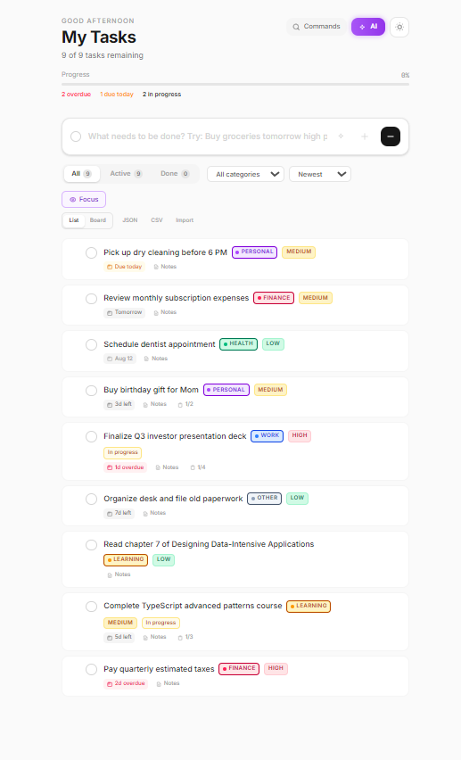
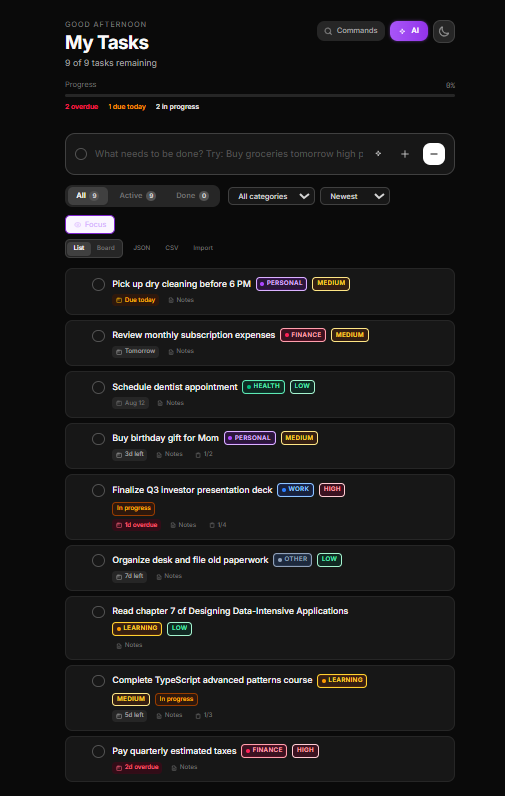
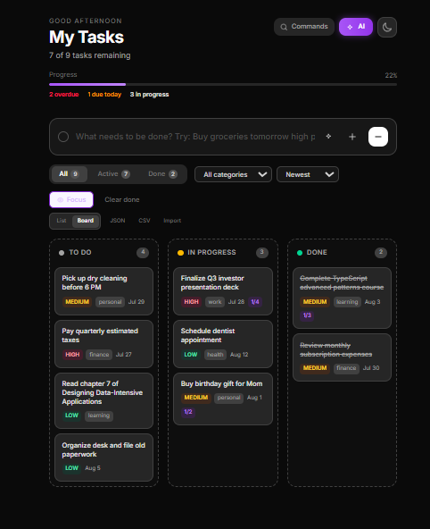
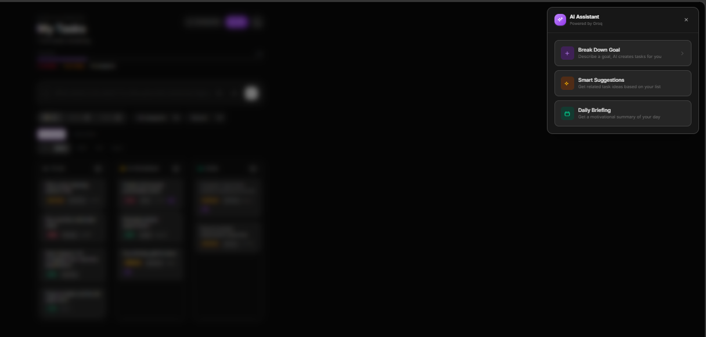
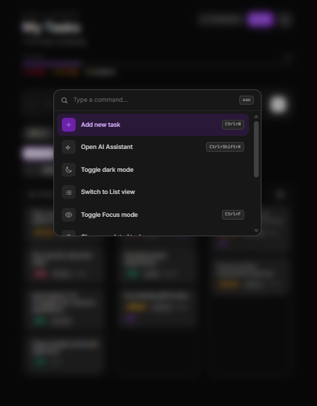

# MindFlow - AI-Powered Task Manager


[](https://mindflow-klxe.onrender.com)


A modern, production-quality React todo application with AI-powered task management, kanban board, dark mode, and extensive organization features.

## Features

### Core Task Management
- **CRUD operations** -- Create, read, update, and delete tasks with localStorage persistence
- **Priority levels** -- Low, Medium, High with distinct color coding
- **Due dates** -- Visual flags for overdue (red) and due-today (amber)
- **Completion tracking** -- Progress bar with percentage, stats counter
- **Bulk clear** -- Clear all completed tasks in one click

### Organization
- **6 task categories** -- Work, Personal, Health, Learning, Finance, Other with color-coded badges
- **3 task statuses** -- Todo, In Progress, Done -- quick toggle from list or board view
- **Filtering** -- By status (All / Active / Done) and by category
- **Sorting** -- Newest first, oldest first, priority (high to low), priority (low to high), alphabetical
- **Focus mode** -- Temporarily hides all completed tasks
- **Task notes** -- Expandable per-task notes, editable inline
- **Subtasks** -- Add, toggle, and delete subtasks with progress indicator bar

### Views
- **List view** -- Traditional vertical task list with drag-and-drop reordering
- **Kanban board** -- 3-column board (To Do / In Progress / Done) with drag-to-move between columns

### Recurring Tasks
- Set tasks to repeat daily, weekly, or monthly
- Completing a recurring task automatically creates the next instance

### AI Features (Powered by Groq)
- **Goal breakdown** -- Describe a goal and AI breaks it into actionable tasks with priorities and notes
- **Smart suggestions** -- AI recommends follow-up tasks based on your existing task list
- **Daily briefing** -- Motivational summary of your day's priorities
- **NLP task parsing** -- Type "Buy groceries tomorrow high priority" and AI parses it into a structured task
- **AI-enhance notes** -- Generate bullet-point tips and steps for any task

### Keyboard Shortcuts
- `Ctrl + K` -- Open command palette (searchable action menu)
- `Ctrl + N` -- Focus new task input
- `Ctrl + F` -- Toggle focus mode
- `Esc` -- Dismiss AI panel, briefing, or command palette

### Command Palette
- Searchable overlay with quick actions: new task, AI assistant, theme toggle, view switch, focus mode, clear completed, export/import, load demo data, daily briefing

### Export & Import
- **JSON export** -- Download all tasks as a `.json` file for backup
- **CSV export** -- Download tasks as a `.csv` file for spreadsheet use
- **JSON import** -- Restore tasks from a previously exported or compatible `.json` file

### Notifications
- Browser notifications for overdue tasks and tasks due today
- Polls every 60 seconds, deduplicates alerts

### UI / UX
- **Dark mode** -- Class-based dark mode with persistent preference
- **Responsive design** -- Fully responsive, works on mobile and desktop
- **Animations** -- Staggered entry, slide-in/out, check bounce, pulse glow on AI button
- **Custom date picker** -- Portal-based calendar (not native HTML date input)
- **Demo data** -- 12 pre-configured tasks covering all features for exploration
- **Drag-and-drop** -- Reorder tasks in list view, move between columns in board view

## Tech Stack

| Technology | Version | Purpose |
|---|---|---|
| [React](https://react.dev) | 19 | UI framework |
| [Vite](https://vitejs.dev) | 8 | Build tool and dev server |
| [Tailwind CSS](https://tailwindcss.com) | 4 | Utility-first CSS framework |
| [Groq Cloud](https://groq.com) | - | LLM API for AI features (Llama 3.3 70B) |
| [Oxlint](https://oxc.rs) | 1 | JavaScript/TypeScript linter |

## Project Structure

```
todo-app/
├── public/
│   └── favicon.svg
├── src/
│   ├── components/
│   │   ├── AddTaskForm.jsx      # Task creation form with NLP parsing
│   │   ├── AIAssistant.jsx      # Slide-in AI panel
│   │   ├── CategoryBadge.jsx    # Colored category pill
│   │   ├── CommandPalette.jsx   # Ctrl+K searchable action menu
│   │   ├── DatePicker.jsx       # Portal-based calendar date picker
│   │   ├── ExportImport.jsx     # JSON/CSV export and JSON import
│   │   ├── FilterBar.jsx        # Status, category, sort, focus controls
│   │   ├── KanbanBoard.jsx      # 3-column board with drag-and-drop
│   │   ├── SubtaskList.jsx      # Subtask list with progress bar
│   │   ├── TaskItem.jsx         # Individual task row
│   │   ├── TaskList.jsx         # Task list with drag-to-reorder
│   │   └── ThemeToggle.jsx      # Dark mode toggle
│   ├── data/
│   │   └── demoTasks.js         # 12 demo tasks
│   ├── hooks/
│   │   ├── useDarkMode.js       # Dark mode persistence
│   │   ├── useKeyboard.js       # Global keyboard shortcuts
│   │   ├── useLocalStorage.js   # localStorage-backed useState
│   │   ├── useNotifications.js  # Browser notification polling
│   │   └── useTasks.js          # Core task CRUD and state
│   ├── services/
│   │   └── ai.js                # Groq API client
│   ├── App.jsx                  # Main app, state orchestration
│   ├── index.css                # Tailwind config, custom tokens, animations
│   └── main.jsx                 # Entry point
├── .env                         # Groq API key (git-ignored)
├── .gitignore
├── index.html
├── package.json
└── vite.config.js               # Vite config with Groq proxy
```

## Getting Started

### Prerequisites
- Node.js 18+
- A [Groq Cloud](https://console.groq.com) API key (free tier available)

### Installation

```bash
# Clone the repository
git clone https://github.com/your-username/mindflow.git
cd mindflow

# Install dependencies
npm install

# Create environment file
echo "GROQ_API_KEY=gsk_your_api_key_here" > .env

# Start development server
npm run dev
```

The app will be available at `http://localhost:5173`.

### Production Build

```bash
npm run build
npm run preview
```

## How AI Features Work

The Groq API key is stored server-side in `.env` and never exposed to the browser. Vite's dev server proxies requests from `/api/ai` to `https://api.groq.com/openai/v1`, injecting the API key via the `Authorization` header on the server side.

All AI features use Groq's **Llama 3.3 70B Versatile** model for fast, high-quality responses.

## Keyboard Shortcuts

| Shortcut | Action |
|---|---|
| `Ctrl + K` | Open command palette |
| `Ctrl + N` | Focus new task input |
| `Ctrl + F` | Toggle focus mode |
| `Esc` | Close panels / modals |

## Screenshots

<!-- Add your project screenshots below -->







